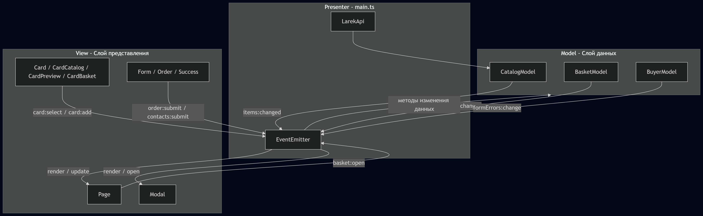

# Проектная работа "Веб-ларек"

Стек: HTML, SCSS, TS, Vite

Структура проекта:
- src/ — исходные файлы проекта
- src/components/ — папка с JS компонентами
- src/components/Models/ — папка с моделями данных

Важные файлы:
- index.html — HTML-файл главной страницы
- src/types/index.ts — файл с типами
- src/main.ts — точка входа приложения
- src/scss/styles.scss — корневой файл стилей
- src/utils/constants.ts — файл с константами
- src/utils/utils.ts — файл с утилитами

## Установка и запуск
Для установки и запуска проекта необходимо выполнить команды

```
npm install
npm run dev
```

или

```
yarn
yarn dev
```
## Сборка

```
npm run build
```

или

```
yarn build
```
# Интернет-магазин «Web-Larёk»
«Web-Larёk» — это интернет-магазин с товарами для веб-разработчиков, где пользователи могут просматривать товары, добавлять их в корзину и оформлять заказы. Сайт предоставляет удобный интерфейс с модальными окнами для просмотра деталей товаров, управления корзиной и выбора способа оплаты, обеспечивая полный цикл покупки с отправкой заказов на сервер.

## Архитектура приложения

Код приложения разделен на слои согласно парадигме MVP (Model-View-Presenter), которая обеспечивает четкое разделение ответственности между классами слоев Model и View. 

**Model** — слой данных, отвечает за хранение и изменение данных.  
**View** — слой представления, отвечает за отображение данных на странице.  
**Presenter** — презентер содержит основную логику приложения и отвечает за связь представления и данных.

Взаимодействие между классами обеспечивается использованием событийно-ориентированного подхода. Модели и Представления генерируют события при изменении данных или взаимодействии пользователя с приложением, а Презентер обрабатывает эти события, используя методы как Моделей, так и Представлений.

### Базовый код

#### Класс Component
Является базовым классом для всех компонентов интерфейса. Класс является дженериком и принимает в переменной `T` тип данных, которые могут быть переданы в метод `render`.

**Конструктор**:  
`constructor(container: HTMLElement)` — принимает ссылку на DOM элемент.

**Методы**:  
`render(data?: Partial<T>): HTMLElement` — записывает данные в поля класса через сеттеры и возвращает корневой элемент.  
`setImage(element: HTMLImageElement, src: string, alt?: string): void` — утилитарный метод для установки изображений.

#### Класс Api
Содержит в себе базовую логику отправки запросов.

**Конструктор**:  
`constructor(baseUrl: string, options: RequestInit = {})` — базовый адрес сервера и заголовки.

**Методы**:  
`get(uri: string): Promise<object>` — выполняет GET запрос.  
`post(uri: string, data: object, method: ApiPostMethods = 'POST'): Promise<object>` — выполняет POST запрос.  
`handleResponse(response: Response): Promise<object>` — проверяет ответ сервера на корректность.

#### Класс EventEmitter
Брокер событий реализует паттерн "Наблюдатель". Позволяет отправлять события и подписываться на них. Класс используется для связи слоя данных и представления.

**Методы**:  
`on` — подписка на событие.  
`emit` — инициализация события.  
`trigger` — возвращает функцию, при вызове которой инициализируется требуемое событие.

---

### Данные и модели данных (Model)

#### Класс CatalogModel
Отвечает за хранение массива товаров и управление предпросмотром.
**Методы**: `setItems`, `getItems`, `getItem`, `setPreview`, `getPreview`.

#### Класс BasketModel 
Управляет товарами в корзине покупателя.
**Методы**: `addItem`, `removeItem`, `clear`, `getTotal`, `getCount`, `isInBasket`.

#### Класс BuyerModel 
Хранит данные покупателя и отвечает за их валидацию. Не хранит ошибки в состоянии, а вычисляет их при проверке.
**Методы**: `setField`, `getData`, `clear`, `validate` (проверка данных, возвращает объект ошибок).

---

### Слой коммуникации

#### Класс LarekApi 
Расширяет базовый класс `Api`. Принимает участие в обмене данными между сервером и приложением.
**Методы**: `getProductList` (получение каталога), `orderProducts` (отправка данных заказа).

---

### Слой представления (View)

Все классы представления наследуются от базового класса `Component`.

#### Класс Modal 
Универсальный контейнер для модальных окон. Управляет отображением контента, блокировкой скролла и закрытием.
**Сеттер**: `content` — вставка HTMLElement в контентную область окна.

#### Класс Form
Базовый класс для всех форм. Управляет валидацией, отображением ошибок и активностью кнопки сабмита.
**Сеттеры**: `valid` (активность кнопки), `errors` (текст ошибок).

#### Классы карточек (Card)
Базовый класс `Card` содержит общие элементы (заголовок, цена).
- **CardCatalog** — для отображения в галерее. Реализует логику переключения классов категорий.
- **CardPreview** — детальное описание товара с кнопкой покупки.
- **CardBasket** — компактная строка в корзине с индексом.

#### Класс Basket
Отвечает за отображение списка товаров в корзине и итоговой стоимости.

#### Компоненты страницы
- **Header**: Управляет отображением счетчика товаров и кнопкой корзины.
- **Gallery**: Отвечает за отображение сетки карточек товаров на главной странице.

---

### Список событий в приложении

**View -> Presenter**:
- `card:select` — выбор карточки в каталоге.
- `card:toBasket` — добавление/удаление товара в превью.
- `basket:open` — клик по иконке корзины.
- `card:remove` — удаление товара из корзины.
- `order:open`, `order:submit`, `contacts:submit` — этапы оформления заказа.

**Model -> Presenter**:
- `catalog:changed` — обновление списка товаров.
- `preview:changed` — изменение товара в предпросмотре.
- `basket:changed` — изменение состава корзины.
- `buyer:changed` — изменение данных покупателя или ошибок валидации.

---

## Взаимодействие слоев (Презентер)
Роль Презентера выполняет скрипт `main.ts`, который связывает слои Model и View через брокер событий. Презентер инициализирует модели и компоненты, устанавливает слушатели событий и управляет потоком данных (Model -> Presenter -> View).

